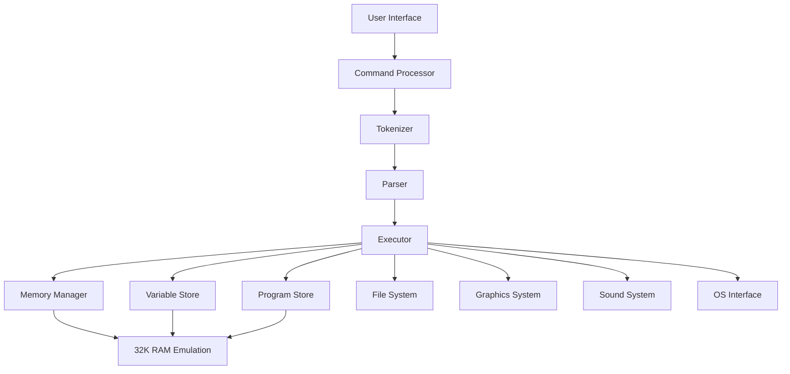

# Design Document: BBC BASIC Interpreter

## Overview

The BBC BASIC Interpreter is a software emulation of the BBC Micro Model B's BASIC interpreter, implementing the complete BBC BASIC language as it existed on the original 6502-based hardware. The interpreter will provide full compatibility with BBC BASIC programs while running on modern systems.

The design follows a modular architecture with clear separation between tokenization, parsing, execution, and system emulation components. The interpreter maintains the original memory layout and behavior patterns to ensure compatibility with existing BBC BASIC software.

## Architecture

The interpreter follows a layered architecture:



### Core Components

1. **Command Processor**: Handles immediate mode commands and program execution control
2. **Tokenizer**: Converts BBC BASIC source code into internal token representation
3. **Parser**: Analyzes tokenized statements and builds execution trees
4. **Executor**: Executes parsed statements and manages program flow
5. **Memory Manager**: Emulates the BBC Model B memory layout and provides memory access
6. **Variable Store**: Manages all BASIC variables, arrays, and their storage
7. **Program Store**: Manages program lines and their tokenized representation

### System Emulation Components

1. **File System**: Emulates BBC Micro file operations and star commands
2. **Graphics System**: Provides screen modes and graphics operations
3. **Sound System**: Emulates the BBC Micro sound generation
4. **OS Interface**: Handles operating system calls and ROM functionality

## Components and Interfaces

### Tokenizer Component

The Tokenizer converts BBC BASIC source code into an internal tokenized format compatible with the original BBC Micro representation.

**Interface:**
```
tokenize(source_line: string) -> TokenizedLine
detokenize(tokenized_line: TokenizedLine) -> string
```

**Token Format:**
- Single-byte tokens for keywords (0x7F-0xFF)
- Extended tokens using prefix bytes (0xC6, 0xC7, 0xC8)
- Line number references using 0x8D prefix
- ASCII characters for literals and identifiers

**Token Categories:**
1. Main keywords (PRINT, FOR, IF, etc.) - tokens 0x7F-0xC5
2. Extended functions (SUM, BEAT) - 0xC6 prefix + token
3. Extended commands (RENUMBER, EDIT) - 0xC7 prefix + token  
4. Extended statements (CASE, MOUSE, SYS) - 0xC8 prefix + token

### Parser Component

The Parser analyzes tokenized BBC BASIC statements and creates abstract syntax trees for execution.

**Interface:**
```
parse_statement(tokens: TokenizedLine) -> Statement
parse_expression(tokens: TokenSequence) -> Expression
```

**Statement Types:**
- Assignment statements (LET, implied assignment)
- Control flow (FOR, IF, WHILE, REPEAT, GOTO, GOSUB)
- I/O statements (PRINT, INPUT, VDU)
- System statements (MODE, SOUND, PLOT)
- Procedure calls (PROC, FN)

### Memory Manager Component

The Memory Manager emulates the exact memory layout of the BBC Model B with 32K RAM.

**Memory Map:**
```
0x0000-0x00FF: Zero page (system variables)
0x0100-0x01FF: Stack
0x0200-0x18FF: System workspace
0x1900-0x7FFF: User memory (PAGE to HIMEM)
0x8000-0xBFFF: Paged ROM space (emulated)
0xC000-0xFFFF: Operating system ROM (emulated)
```

**Interface:**
```
peek(address: u16) -> u8
poke(address: u16, value: u8)
allocate_program_space(size: usize) -> Option<Address>
allocate_variable_space(size: usize) -> Option<Address>
get_page() -> u16  // Returns 0x1900
get_himem() -> u16  // Returns 0x8000
get_top() -> u16   // Returns current top of used memory
```

### Variable Store Component

The Variable Store manages all BBC BASIC variables with proper type handling and memory allocation.

**Variable Types:**
- Integer variables (A%, B%) - 32-bit signed integers
- Real variables (A, B) - IEEE 754 double precision
- String variables (A$, B$) - up to 255 characters
- Arrays of any type with multiple dimensions

**Interface:**
```
set_integer_var(name: string, value: i32)
get_integer_var(name: string) -> Option<i32>
set_real_var(name: string, value: f64)
get_real_var(name: string) -> Option<f64>
set_string_var(name: string, value: string)
get_string_var(name: string) -> Option<string>
dim_array(name: string, dimensions: Vec<usize>, var_type: VarType)
```

### Program Store Component

The Program Store manages BBC BASIC program lines in tokenized format with automatic sorting by line number.

**Line Format:**
```
[Line Number: 2 bytes] [Line Length: 1 byte] [Tokenized Data: variable length] [0x0D]
```

**Interface:**
```
store_line(line_number: u16, tokenized_data: Vec<u8>)
get_line(line_number: u16) -> Option<Vec<u8>>
delete_line(line_number: u16)
get_next_line(current_line: u16) -> Option<(u16, Vec<u8>)>
clear_program()
list_program(start_line: Option<u16>, end_line: Option<u16>) -> Vec<(u16, string)>
```

### Graphics System Component

The Graphics System emulates BBC Micro display modes and graphics operations.

**Supported Modes:**
- MODE 0: 640×256, 2 colors
- MODE 1: 320×256, 4 colors  
- MODE 2: 160×256, 16 colors
- MODE 3: Text mode, 80×25
- MODE 4: 320×256, 2 colors
- MODE 5: 160×256, 4 colors
- MODE 6: 320×200, 2 colors
- MODE 7: Teletext mode, 40×25

**Interface:**
```
set_mode(mode: u8)
plot(plot_type: u8, x: i16, y: i16)
move_to(x: i16, y: i16)
draw_to(x: i16, y: i16)
set_gcol(mode: u8, color: u8)
vdu_output(byte: u8)
```

### Sound System Component

The Sound System emulates the BBC Micro's sound generation capabilities.

**Interface:**
```
sound(channel: u8, amplitude: i16, pitch: u16, duration: u16)
envelope(envelope_num: u8, params: [u8; 14])
```

## Data Models

### Token Representation

```rust
#[derive(Debug, Clone)]
pub enum Token {
    // Basic tokens
    Keyword(u8),           // Single-byte keyword tokens
    ExtendedKeyword(u8, u8), // Extended tokens with prefix
    LineNumber(u16),       // Line number reference
    Integer(i32),          // Integer literal
    Real(f64),            // Real number literal
    String(String),       // String literal
    Identifier(String),   // Variable or procedure name
    Operator(char),       // Operators (+, -, *, etc.)
    Separator(char),      // Separators (,, ;, :)
}
```

### Variable Types

```rust
#[derive(Debug, Clone)]
pub enum Variable {
    Integer(i32),
    Real(f64),
    String(String),
    IntegerArray(Vec<i32>, Vec<usize>), // values, dimensions
    RealArray(Vec<f64>, Vec<usize>),
    StringArray(Vec<String>, Vec<usize>),
}
```

### Statement Types

```rust
#[derive(Debug, Clone)]
pub enum Statement {
    Assignment { target: String, expression: Expression },
    Print { items: Vec<PrintItem> },
    Input { variables: Vec<String> },
    For { variable: String, start: Expression, end: Expression, step: Option<Expression> },
    Next { variables: Vec<String> },
    If { condition: Expression, then_part: Vec<Statement>, else_part: Option<Vec<Statement>> },
    Goto { line_number: u16 },
    Gosub { line_number: u16 },
    Return,
    // ... other statement types
}
```

### Expression Types

```rust
#[derive(Debug, Clone)]
pub enum Expression {
    Integer(i32),
    Real(f64),
    String(String),
    Variable(String),
    ArrayAccess { name: String, indices: Vec<Expression> },
    FunctionCall { name: String, args: Vec<Expression> },
    BinaryOp { left: Box<Expression>, op: BinaryOperator, right: Box<Expression> },
    UnaryOp { op: UnaryOperator, operand: Box<Expression> },
}
```

## Correctness Properties

*A property is a characteristic or behavior that should hold true across all valid executions of a system—essentially, a formal statement about what the system should do. Properties serve as the bridge between human-readable specifications and machine-verifiable correctness guarantees.*

Before writing the correctness properties, I need to analyze the acceptance criteria from the requirements to determine which ones are testable as properties.

### Property 1: Variable Storage and Type Safety
*For any* BBC BASIC variable of any supported type (integer, real, string), storing a value and then retrieving it should return an equivalent value within the type's precision limits.
**Validates: Requirements 2.1, 2.2, 2.3**

### Property 2: Array Bounds and Multi-dimensional Access
*For any* multi-dimensional array of any supported type, accessing elements within bounds should succeed, and accessing elements outside bounds should generate "Subscript out of range" error.
**Validates: Requirements 2.4, 2.5, 2.6**

### Property 3: Memory Layout and Access Consistency
*For any* valid memory address within the 32K RAM space, POKE followed by PEEK at the same address should return the same value, and PAGE should always return &1900 while HIMEM should always return &8000.
**Validates: Requirements 3.1, 3.2, 3.3**

### Property 4: Program Line Management
*For any* set of program lines with valid line numbers (0-65535), storing them in any order should result in retrieval in numerical order, and line replacement should overwrite existing lines correctly.
**Validates: Requirements 4.1, 4.2, 4.3**

### Property 5: Tokenization Round-trip Consistency
*For any* valid BBC BASIC source line, tokenizing then detokenizing should produce equivalent source code that executes identically.
**Validates: Requirements 1.1, 14.2**

### Property 6: Control Flow Execution Correctness
*For any* control flow construct (FOR...NEXT, IF...THEN...ELSE, WHILE...ENDWHILE, REPEAT...UNTIL), the number of iterations and execution paths should match the mathematical specification of the construct.
**Validates: Requirements 1.5**

### Property 7: File I/O Round-trip Consistency
*For any* BBC BASIC program, saving it with *SAVE and then loading it with *LOAD should result in an identical program that executes the same way.
**Validates: Requirements 6.1, 6.2**

### Property 8: Graphics Mode Properties
*For any* supported graphics mode, setting the mode should result in the correct screen resolution and color depth as specified in the BBC Micro documentation.
**Validates: Requirements 7.1, 7.2**

### Property 9: Mathematical Function Accuracy
*For any* built-in mathematical function and valid input within its domain, the function should return a result within acceptable floating-point precision of the mathematically correct answer.
**Validates: Requirements 10.1, 10.2, 10.3**

### Property 10: Error Reporting Consistency
*For any* syntax or runtime error condition, the interpreter should generate an appropriate error message with correct line number information and stop execution at the proper point.
**Validates: Requirements 12.1, 12.2**

### Property 11: Procedure and Function Isolation
*For any* procedure or function with LOCAL variables, modifications to local variables should not affect global variables of the same name, and parameter passing should not modify the original arguments unless passed by reference.
**Validates: Requirements 9.3, 9.4**

### Property 12: Assembly Code Generation Correctness
*For any* valid 6502 assembly instruction within square brackets, the generated machine code should match the official 6502 instruction encoding.
**Validates: Requirements 13.5**

### Property 13: Sound Generation Parameters
*For any* valid SOUND statement parameters, the generated tone should have the specified pitch, duration, and volume within the capabilities of the sound system.
**Validates: Requirements 8.1, 8.2**

### Property 14: Memory Exhaustion Handling
*For any* operation that would exceed available memory, the interpreter should generate a "No room" error before corrupting existing data or crashing.
**Validates: Requirements 3.5**

### Property 15: Random Number Distribution
*For any* sequence of RND function calls, the generated numbers should be uniformly distributed within the specified range and have appropriate statistical properties.
**Validates: Requirements 10.4**

## Error Handling

The interpreter implements comprehensive error handling that matches the original BBC BASIC behavior:

### Error Types
- **Syntax Errors**: Detected during tokenization and parsing
- **Runtime Errors**: Detected during execution
- **System Errors**: Memory exhaustion, file system errors

### Error Reporting
- Error messages include error type and line number
- Execution stops at the point of error
- Error state can be queried using ERR and ERL functions

### Custom Error Handling
- ON ERROR statements allow custom error handling
- RESUME statements allow continuation after handled errors
- Error handlers can be nested and properly unwound

## Testing Strategy

The BBC BASIC interpreter will be tested using a dual approach combining unit tests and property-based tests to ensure comprehensive coverage and correctness.

### Property-Based Testing
Property-based tests will validate the universal correctness properties identified in this design. Each property will be implemented as a separate test that generates random inputs and verifies the property holds across all test cases.

**Configuration:**
- Minimum 100 iterations per property test
- Tests will use QuickCheck-style property testing framework
- Each test tagged with: **Feature: bbc-basic-interpreter, Property N: [property description]**

**Key Property Tests:**
- Variable storage round-trip consistency
- Memory access consistency (PEEK/POKE)
- Tokenization round-trip preservation
- Control flow execution correctness
- File I/O round-trip consistency
- Mathematical function accuracy
- Error handling consistency

### Unit Testing
Unit tests will verify specific examples, edge cases, and integration points between components.

**Focus Areas:**
- Specific BBC BASIC program examples
- Edge cases for each data type
- Error conditions and boundary values
- Integration between major components
- Compatibility with known BBC BASIC programs

**Test Organization:**
- Component-level tests for each major module
- Integration tests for component interactions
- End-to-end tests for complete program execution
- Regression tests for compatibility issues

### Compatibility Testing
A comprehensive test suite of original BBC BASIC programs will be used to verify compatibility:
- Standard BBC BASIC example programs
- Games and applications from the BBC Micro era
- Edge case programs that test unusual behaviors
- Programs that use advanced features like inline assembly

The testing strategy ensures both correctness of individual components and overall system behavior that matches the original BBC Micro hardware.